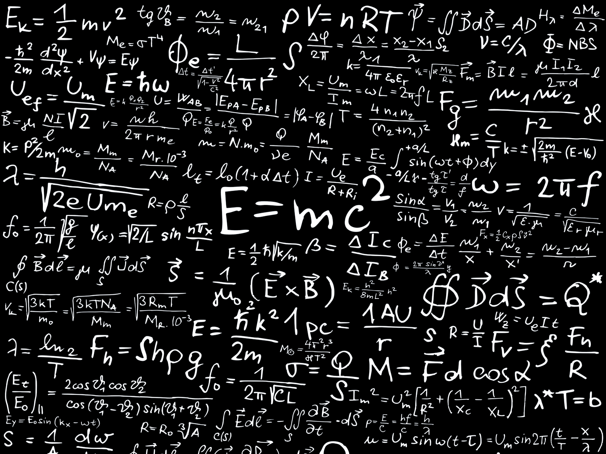

### What's a function?

#### Running Python scripts

    $ conda activate nanos
    $ ipython
    [1] odds = [n for n in range(10) if n % 2 == 1]
    [2] print("The first odds: ", odds)
    [3] odds. # press tab after the '.' and select 'count'
    [4] !ls # we can execute shell commands
    [5] %save odds.py 1-2
    [6] ?print
    [7]  ?
    [8]] %quickref # 'q' to quit, ctrl+up/down, /pattern, n/p
    [7] quit()
    $ python odds.py
    $ ipython qtconsole
    $ ipython --pylab

#### Lambdas (not Lambadas) 

    # Lambda: short inline function

    add10 = lambda a: a + 10
    type(add10)
    print(add10(23))

    def compute(func, param):
        return func(param)
    
    print("Result: ", compute(add10, 13))

    add = lambda a, b: a + b

    def compute(func, *params): # using *args
        return func(*params)

    print("Result: ", compute(add, 13, 31))

#### Lambdas for a spin with a map

    plus10 = list(map(add10, range(10)))

    additions = list(map(add, [10, 20, 1, 2, 3], [30, 40, 3, 4, 5]))

    mapping = map(add10, range(10))
    for v in mapping: print(v)

    # lambdas are anonymous functions!
    squares = list(map(lambda a: a**2, range(5)))
    odds = list(map(lambda a: 2*a+1, range(5)))

    # Map: http://book.pythontips.com/en/latest/map_filter.html

#### Plotting a function with matplotlib
    import numpy as np
    import pylab as plt

    X = np.linspace(0,5,100)
    Y1 = X + 2*np.random.random(X.shape)
    Y2 = X**2 + np.random.random(X.shape)

    fig, ax = plt.subplots()
    ax.plot(X,Y1,'o')
    ax.plot(X,Y2,'x')
    plt.show()

#### Plotting scatterplots
    import numpy as np
    import pylab as plt

    X = np.linspace(0,5,100)
    Y1 = X + 2 * np.random.random(X.shape)
    Y2 = X**2 + np.random.random(X.shape)

    plt.scatter(X,Y1,color='k')
    plt.scatter(X,Y2,color='g')
    plt.show()

#### Tutorial on plotting from matplotlib.org

    import matplotlib.pyplot as plt
    plt.plot([1, 2, 3, 4])
    plt.ylabel('some numbers')
    plt.show()

    # x,y
    plt.plot([1, 2, 3, 4], [1, 4, 9, 16])

    # x,y, red dots
    plt.plot([1, 2, 3, 4], [1, 4, 9, 16], 'ro')
    plt.axis([0, 6, 0, 20])
    plt.show()

#### Multiple plots on the same graph

    import numpy as np

    # evenly sampled time at 200ms intervals
    t = np.arange(0., 5., 0.2)

    # red dashes, blue squares and green triangles
    plt.plot(t, t, 'r--', t, t**2, 'bs', t, t**3, 'g^')
    plt.show()

#### Scatter plotting with different colors and sizes

    data = {'a': np.arange(50),
            'c': np.random.randint(0, 50, 50),
            'd': np.random.randn(50)}
    data['b'] = data['a'] + 10 * np.random.randn(50)
    data['d'] = np.abs(data['d']) * 100

    plt.scatter('a', 'b', c='c', s='d', data=data)
    plt.xlabel('entry a')
    plt.ylabel('entry b')
    plt.show()

#### Multiple figures

    def f(t):
        return np.exp(-t) * np.cos(2*np.pi*t)

    t1 = np.arange(0.0, 5.0, 0.1)
    t2 = np.arange(0.0, 5.0, 0.02)

    plt.figure(1)
    plt.subplot(211)
    plt.plot(t1, f(t1), 'bo', t2, f(t2), 'k')

    plt.subplot(212)
    plt.plot(t2, np.cos(2*np.pi*t2), 'r--')
    plt.show()

#### Annotating text

    ax = plt.subplot(111)

    t = np.arange(0.0, 5.0, 0.01)
    s = np.cos(2*np.pi*t)
    line, = plt.plot(t, s, lw=2)

    plt.annotate('local max', xy=(2, 1), xytext=(3, 1.5),
        arrowprops=dict(facecolor='black', shrink=0.05),
    )

    plt.ylim(-2, 2)
    plt.show()

#### Slope - rate of change
    # Slope = rate of change 
    # ladder analogy, step 1, step2, step3??? step4?????)

    X = np.linspace(-5,5,100)
    plt.plot(X, X**2-3*X+10)

    # Let's the the slope for (4,14) - (3,10)
    # slope = (dif in y/dif in x) = (14-10) / (4-3) = 4
    plt.plot(X, 4*X) # Not quite there as the tangent

    plt.plot(X, 4*X=2) # Quite close!

TODO: great first approach, but really want to use
    x = x - learning_rate * dx

#### How do we find the minimum of a function?
    - By approximation. How? How many steps?

    Y = lambda x: x**2 - 3*x + 10
    plt.plot(X, Y(X))

    Pick 2 points, compute the slope
    p1 = (3, Y(3)) # 10?
    p2 = (4, Y(4)) # 14?
    slope = (p2[1] - p1[1]) / (p2[0] - p1[0])
    # slope = 4    # quite steep!
    plt.plot(X, X*slope)
    plt.plot(X, X*slope-2) # -2?  4/2?

    plt.plot(X, X)

    # How do we find out the zero slope?
    # Well, the slope is 4, very steep and positive.
    # For a "convex" function, we want to go opposite the slope direction

    step = -1
    p1 = (2, Y(2))
    p2 = (3, Y(3))
    slope = (p2[1] - p1[1]) / (p2[0] - p1[0])
    # slope = 2.0 # The slope has decreased! Keep going!
    plt.plot(X, slope*X)
    plt.plot(X, slope*X+4)

#### Let's keep searching for the minimum
    step = -2
    p1 = (0, Y(0))
    p2 = (1, Y(1))
    slope = (p2[1] - p1[1]) / (p2[0] - p1[0])
    # slope = -2  # Ooops. We are negative!
    plt.plot(X, X*slope) 

    step = +1
    p1 = (1, Y(1))
    p2 = (2, Y(2))
    slope = (p2[1] - p1[1]) / (p2[0] - p1[0])
    # slope = 0 
    plt.plot(X, slope*X)
    plt.plot(X, slope*X+8)

#### Are we there?
    # But there are many points with slope = 0
    # Let's get a "better" approximation to Min(x,Y(x))

    step=.49, .51
    p1 = (1.49, Y(1.49))
    p2 = (1.51, Y(1.51))
    slope = (p2[1] - p1[1]) / (p2[0] - p1[0])
    # slope = 0 # Still zero, but this point is closer to the truth
    # Guessing that the minimum is at (1.5, Y(1.5))

    Algorithm

    Loop
        Compute the slope at current position
        Is the slope == 0, break
        Is the slope positive? go to the left
        Is the slope negative? go to the right

#### Summary
    Concepts:
        - learning rate (step)
        - optimizer
        - error margin (threshold tolerance)

    Python Competition: implement the "fastest" search 
    for the minimum given a lambda as an input. 
    "Fastest" is defined as the minimum number of 
    iterations to get the minimum

    minimum, steps = find_minimum(some_lambda)

#### Numpy ndarray

    import matplotlib.pyplot as plt

    img = plt.imread("panda-corner.jpg")
    type(img) # prints "numpy.ndarray"

    import numpy as np
    A = np.array([0, 1, 2, 3, 4])
    A.shape
    A[5] = 10 # Array index out of bounds!

#### Numpy basics

    import numpy as np

    A = [[1, 2, 3, 8],
        [2, 0, 3, 9],
        [0, 1, 3, 1]]

    B = [[3, 1], [4, 4], [6, 5], [2, 0]]
    
    X = np.matmul(A, B)
    X.T

    [1, 2, 3] * 2
    np.array([2, 3, 3]) * 2 + 5

    [1, 2, 3] + [2, 3, 4]
    np.array([1, 2, 3]) + np.array([2, 3, 4])

#### Numpy slicing
    B = np.zeros((3, 4, 5))
    C = B[:,:,0]
    C[0, 0, 0] # Can we do this with a regular array?

    A = [n for n in range(9)]
    A_2D = np.reshape(A, (3, 3))
    A_flat = np.reshape(A_2D, (9))
    A_2D.T

    B = np.arange(27)
    B_3D = B.reshape((3, 3, 3))
    B_flat = B_3D.reshape((3 * 3 * 3))
    B_3D.T

    vals = np.arange(10)
    vals = vals + 10
    idx = [2, 3, 5]
    vals[idx]

### Jupyter Notebooks

- Run locally
        $ conda activate nanos
        $ jupyter notebook . 
- Execute: Shift+Return (execute the cell)

- How to add the nano kernel to jupyter
        $ conda install nb_conda
        python -m ipykernel install --user --name nano --display-name "Python (nano)"

- Tutorial
https://www.datacamp.com/community/tutorials/tutorial-jupyter-notebook

### Jupyter Tools

- Post a notebook
    - https://nbviewer.jupyter.org/
    - Share on your github as an .ipynb file

- Jupyterize your github?
    - https://mybinder.org/

- Collaborate on a notebook (google docs)
    - https://colab.research.google.com/

### Magenta.js

    Hello Magenta
    https://medium.com/@oluwafunmi.ojo/getting-started-with-magenta-js-e7ffbcb64c21
    https://hello-magenta.glitch.me/

    Melody Mixer
    https://experiments.withgoogle.com/ai/melody-mixer/view/
    https://github.com/googlecreativelab/melody-mixer

### Reference
- Colab
    - https://towardsdatascience.com/getting-started-with-google-colab-f2fff97f594c

- Python Tutorial
    https://docs.python.org/3/tutorial/
    https://www.learnpython.org/

### GLSL Reference

    - The Book of Shaders
    https://thebookofshaders.com/
    - Kodelife
    https://hexler.net/software/kodelife/
    - Hydra Editor
    https://glitch.com/~hydra-editor
    - TouchDesigner GLSL https://www.youtube.com/watch?v=FImsLtt4Ab4&index=2&list=PLSqkC3f_BStzZ9CyGW9ahN8Sb_zoCWak1

### Matplotlib Reference

- Examples
    - https://matplotlib.org/examples/index.html
    - https://github.com/matplotlib/matplotlib

- Tutorial
    - https://matplotlib.org/tutorials/introductory/pyplot.html
    - https://matplotlib.org/tutorials/index.html
    - https://www.datacamp.com/community/tutorials/matplotlib-tutorial-python

### Animation with Matplotlib

- Animation with Matplotlib
https://jakevdp.github.io/blog/2012/08/18/matplotlib-animation-tutorial/

- Animation Examples
https://matplotlib.org/examples/animation/index.html

